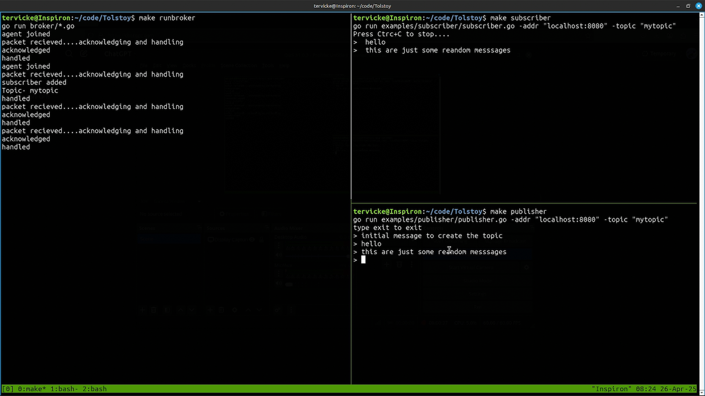

# A lightweight pub sub system written in golang 
read the [specs](specs.md) to get a understanding of how the pub susb system .

##  Running the example
TO run the example follow these steps 
1. Start the main broker
```
make runbroker
```
2. Run the publisher , in a different terminal instance
```
make publisher
```
> **send a initial message so that the server has topic created**

3. Run subscriber 
```
make subscriber
```


## ToDo
- [x] Make a simple demo publisher in Go
- [x] Make a simple demo subscriber in go
- [ ] Add baisc authentication in the topic access
- [x] Persistent storage of messages 
- [ ] Write a small benchmark tool
- [x] Add logging
- [x] better readme and build & run instructions


